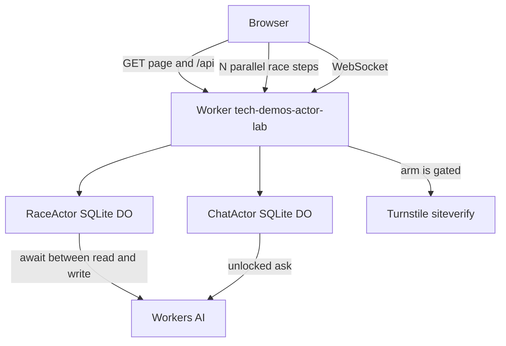

# Plan — actor-lab

## Goal

A visitor races concurrent counter updates through a Workers AI wait and sees a Durable Object lose updates when handlers interleave, then keeps a multiplayer chat on a hibernating WebSocket whose SQLite history survives a simulated eviction.

This is an **inspired-by slice** of [TerseAI/durable-actors](https://github.com/TerseAI/durable-actors) (MIT), not a port of that runtime. The note that pointed at it: [karatzas_thomas on X](https://x.com/karatzas_thomas/status/2107872102829502622).

## Research (upstream)

Upstream is a **separate actor runtime** (self-hosted on GCP, TypeScript and Python clients). It is not a Cloudflare Durable Objects library.

| Upstream | This slice |
| --- | --- |
| `Actor` class, handlers run one at a time across `await` | Small `Actor` base on a real SQLite Durable Object. A mailbox queues handlers. |
| `@Persisted` fields, committed when the call succeeds, rolled back on failure | A `state` proxy writes each assignment to SQLite immediately. No method-level rollback. |
| `@Ephemeral` fields, dropped when the actor shuts down | Chat scratch lives in isolate memory only. |
| `@Interleave` lets other calls run during `await` | Race toggle: mailbox vs handlers that run as soon as the input gate opens. |
| `@Emittable`, generated clients, socket grants | Hand-rolled HTTP + hibernatable WebSockets. No codegen. |
| OpenAI via the AI SDK | Workers AI binding. Fail soft to a labelled delay or a canned reply. |
| Their SQLite (`this.db`) inside their runtime | `ctx.storage.sql` on the Durable Object. |
| `@Compute` resource hints | Cut. No Containers. |

**Cut:** Python SDK, GCP self-host, client generator, `@Emittable`, `@Compute`, OpenAI, method-end rollback, a real "evict this isolate" API (Cloudflare does not expose one).

## Single-user MVP

- In:
  - `Actor` base: `blockConcurrencyWhile` while loading, proxy fields flushed to SQLite, mailbox so handlers run one at a time.
  - Race lab on one per-visitor Durable Object. N is 2–6. Each update reads the counter, awaits Workers AI, writes `read + 1`.
  - Toggle **interleaved** (no mailbox) vs **serialized mailbox**. Timeline plus a plain-language note on input gates, output gates, and `blockConcurrencyWhile`.
  - Chat room Durable Object. Hibernatable WebSocket, last 40 messages in SQLite, in-memory scratch, **Simulate evict** reloads from SQLite and clears the scratch.
  - Workers rate limits on race and chat. Turnstile on race arm and chat AI unlock. AI routes fail closed without a real `TURNSTILE_SECRET` in production.
  - Visitor cookie addresses the race actor. Rooms are unguessable codes and expire by alarm (6 hours idle). No accounts.
  - Graphite & Ember UI, hub registry fallback, `PLAN.md` / `README.md` / `CHANGELOG.md`.
- Out: upstream runtime, codegen, OpenAI, auth, D1/R2/Queues, Workers for Platforms, Containers, Browser Run.

## Tasks

1. Actor base (schema, proxy, mailbox, alarm wipe) and the race Durable Object.
2. HTTP API: config, arm, step, result, with Turnstile and rate limits.
3. Chat Durable Object: hibernating sockets, say, scratch, evict, AI unlock.
4. Vanilla UI: timeline, gates copy, room, scratch, simulate evict.
5. Hub fallback entry (append only).
6. Typecheck, `wrangler dev`, `scripts/smoke.ts`, screenshot, video, one PR.

## Stack

- **Workers + Static Assets** — same standalone shape as resolve-hq, path prefix and subdomain.
- **SQLite Durable Objects** — per-actor storage and hibernatable WebSockets are the point of the slice.
- **Workers AI** — the non-storage await that opens the input gate, and the chat reply.
- **Rate Limiting + Turnstile** — bound the AI paths. Test keys locally; fail closed in production.
- **No Hono, no React, no durable-actors package.** The mailbox is the demo.

## Architecture

Worker `tech-demos-actor-lab`:

- `tech-demos.theserverless.dev/demos/actor-lab*`
- `actor-lab.tech-demos.theserverless.dev/*`

Per-visitor race actors are named by an `HttpOnly` cookie. Chat actors are named by a 6-character room code. Alarms delete actor rows after 6 hours idle.

## Cost

- Two Durable Objects per active visitor/room, SQLite writes of a counter and a short transcript.
- Race N ≤ 6, `max_tokens` 8 on the race model call, chat replies capped, 30 race ops and 30 chat ops per minute per IP.
- Turnstile in front of every race arm and every AI unlock.
- No Containers, Browser Rendering, Vectorize, or Workers for Platforms.

## Testing

- `bun run typecheck`
- `bun run dev` uses `wrangler.dev.jsonc` (no Workers AI binding) so it boots without a Cloudflare login. `bun run dev:ai` uses the real binding after `wrangler login`. Deploy uses `wrangler.jsonc`.
- `scripts/smoke.ts` against `wrangler dev`: health, Turnstile rejection, interleaved loss, serialized counter, room say, websocket fan-out, scratch cleared on evict, messages kept.
- Browser pass of both modes, then chat, scratch, simulate evict. Screenshot and short video.

## Deferred

- Method-end transactions and rollback (upstream commits `@Persisted` when the call succeeds; once any method uses `@Interleave`, upstream also stops rolling back).
- Generated typed clients and the Python SDK.
- A platform eviction button. Simulate evict drops isolate fields and re-reads SQLite, which is what a real wake does.
- Accounts, room admin, and durable rate-limit windows inside the actor (the in-memory chat window resets if the isolate dies; the binding still limits by IP).
