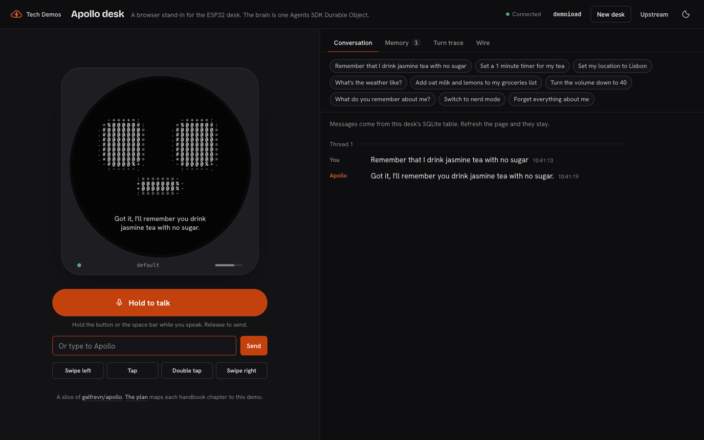

# Apollo desk

This demo is a browser desk that talks to an Apollo-style brain on Cloudflare. It is a slice of
[galfrevn/apollo](https://github.com/galfrevn/apollo), "the open-source brain for physical agentic devices".
Upstream connects an ESP32 desk with a round screen. This demo puts that desk in the browser. The brain is one
Agents SDK `Agent` with its own SQLite database.

- **Live:** <https://tech-demos.theserverless.dev/demos/apollo-desk/>
- **Subdomain:** <https://apollo-desk.tech-demos.theserverless.dev/>
- **Plan:** [PLAN.md](./PLAN.md) maps each chapter of the Apollo handbook to this slice.

The demo runs on Workers Paid. It does not use Workers for Platforms, Containers, or Vectorize.



## What a visitor sees

1. The page opens a desk at a random `?desk=` link. The link is the capability for one Agent instance.
2. Hold the talk button or the space bar and speak. Or type, or click a suggested turn.
3. The face changes state: listening, thinking, speaking. Captions show each tool as it runs, and the reply plays aloud.
4. Tell Apollo a fact, set a timer, save a city, or add to a list. Refresh the page. The conversation, the facts,
   the list, and the timer arc come back from the Durable Object.
5. Ask it to turn the volume down. The brain sends a JSON-RPC `tools/call` to the MCP server that runs in the desk.
6. Ask it to forget everything. That tool is unsafe, so the desk shows Yes and No for 30 seconds.
7. Tap the screen for the clock and weather. Swipe the screen to change the speech mode and the accent colour.
8. The console shows the SQLite transcript, the facts with their vector scores, the schedules, a turn trace with
   token costs, and every wire frame.

## Architecture

```
browser desk (face, mic, speaker, MCP server)
      │  AgentClient WebSocket: JSON device frames + 16 kHz PCM binary frames
      ▼
Worker  ── strips /demos/apollo-desk, checks Origin, routeAgentRequest
      ▼
Apollo Agent (Durable Object, SQLite)
  ├─ turn loop: whisper-large-v3-turbo → glm-5.3-flash with tools (3 rounds) → melotts
  ├─ tables: messages, memories (+384-dim vector BLOB), list_items, pending_confirmations, pending_device_messages
  ├─ this.schedule(): timers, reminders, confirmation expiry
  ├─ setState(): speech mode, location, thread, device settings
  ├─ @callable inspect() and probeMemory() for the console
  └─ Meter DO: one shared daily Workers AI budget
```

| File | Role |
|---|---|
| `src/worker/index.ts` | Base path, Origin check, agent routing, and static assets |
| `src/worker/apollo.ts` | The `Apollo` Agent: device protocol, turn loop, tool router, confirmations, schedules, MCP bridge, and memory |
| `src/worker/tools.ts` | The tool catalog. Each tool has a Zod schema, a safety level, and a caption |
| `src/worker/memory.ts` | Embeddings, cosine recall, and keyword recall |
| `src/worker/voice.ts` | The WAV header, speech to text, and text to speech |
| `src/worker/meter.ts` | The daily AI budget |
| `src/worker/weather.ts` | Open-Meteo geocoding and forecast |
| `src/shared/protocol.ts` | The wire contract, speech modes, and the face emotion map |
| `src/client/desk.ts` | The desk, the MCP server in the desk, and the console |
| `src/client/face.ts` | The glyph face on a canvas |
| `src/client/audio.ts` | Microphone capture at 16 kHz, playback, and earcons |

## Run it

```bash
bun install
cd demos/apollo-desk
bun run dev          # builds the client, then runs wrangler dev on :8787
bun run typecheck
bun run deploy
```

The Workers AI binding always calls the remote service, even in `wrangler dev`.

Smoke test. The script acts as a desk over the WebSocket:

```bash
bun run scripts/smoke.ts http://127.0.0.1:8787
bun run scripts/smoke.ts https://tech-demos.theserverless.dev/demos/apollo-desk --voice path/to/16k-mono.wav
```

## Cost guards

- The `Meter` Durable Object holds a daily budget for all desks: `AI_DAILY_BUDGET_USD`, default `0.10`.
- A Rate Limiting binding allows 10 turns each minute for each IP address.
- A hold sends 15 seconds of audio or less. A desk keeps 200 facts or fewer and 100 list items or fewer.
- One text turn with a tool costs about $0.0006 on `glm-5.3-flash`. Speech costs less than $0.0001.

## Deploy

`tech-demos-apollo-desk` is a standalone Worker, because it needs Durable Objects and Workers AI. It has two zone routes:

- `tech-demos.theserverless.dev/demos/apollo-desk*`
- `apollo-desk.tech-demos.theserverless.dev/*`

The hub registry keeps a fallback Dynamic Worker. The fallback sends the visitor to the subdomain if the path route is missing.
