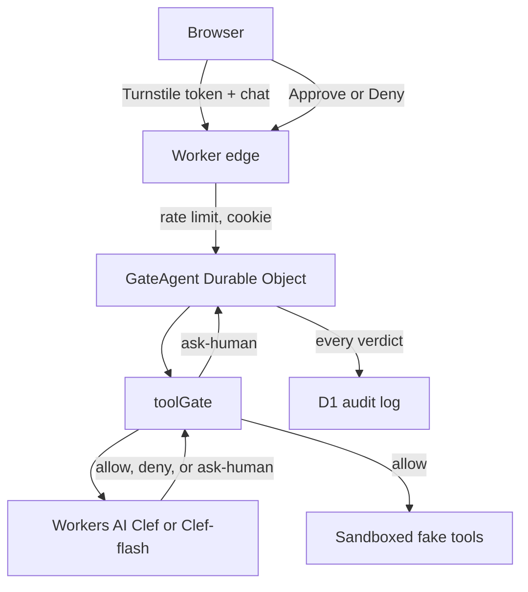

# Plan — clef-gate

## Goal

A visitor chats with an Agents SDK desk whose five sandboxed tools do nothing real, and before every tool call Clef or Clef-flash returns allow, deny, or ask-human with probabilities — pausing inside the Durable Object until the visitor approves or denies.

Inspired by [yologdev/yoagent `clef-worker`](https://github.com/yologdev/yoagent/tree/main/integrations/yoagent-workers/examples/clef-worker) (MIT). Not a port of that Rust worker.

## Research

Model ids checked against the Cloudflare docs (1 Oct 2026 changelog and the model pages):

| Model | Workers AI id | Request `model` field |
| --- | --- | --- |
| Clef (27B) | `@cf/cloudflare/clef` | `clef` |
| Clef-flash (9B) | `@cf/cloudflare/clef-flash` | `clef-flash` |

Clef speaks the System One API: a `state` plus typed `questions`, and `answers.<id>.probabilities` for a `choice` question. This slice asks one choice — `allow`, `deny`, `ask-human` — instead of upstream's two yes/no questions (`destructive`, `requested`).

Upstream runs yoagent on DeepSeek with `list_notes` / `delete_note`, a bearer `RUN_TOKEN`, and an optional Jev gate. Those stay out. The pause is durable state in the agent DO (the HTTP request returns; Approve/Deny resumes it). A blocked `await` inside one request would die on the Worker time limit.

Repo issue #95 asks for shared guardrails. `toolGate()` is a typed module with no I/O of its own so that package can re-export it later. This PR does not create the package.

## Single-user MVP

- In:
  - One Worker + static Graphite & Ember UI (LogoMark, Bricolage Grotesque, Hanken Grotesk, Contact link).
  - Agents SDK Durable Object per anonymous session. SQLite holds the transcript and at most one pending tool call.
  - Fake tools only: `read_docs`, `fetch_url`, `send_email`, `delete_record`, `run_sql`. No network fetch, no email, no SQL against D1.
  - `toolGate()` calls Clef or Clef-flash. The UI shows the three probabilities. Toggle the model.
  - Confidence below `0.62` becomes ask-human. Ask-human waits in the DO until Approve, Deny, or a 10-minute expiry.
  - D1 audit row per decision: tool, args summary, decision, probabilities, latency, model, human outcome.
  - Turnstile on session start, chat, and approval. Workers rate limits on those writes. Sessions and audit rows expire (DO alarm + hourly cron).
  - Localhost only: if Workers AI is unreachable, a labeled heuristic stands in so the desk still runs. Production fails closed (deny, source `unavailable`). The always-pass Turnstile test secret is rejected off localhost.
- Out: DeepSeek, Jev, real side effects, vision inputs, the shared `@tech-demos/guardrails` package, Workers for Platforms, multi-user rooms.

## Tasks

1. `toolGate()` plus the System One choice parser and the confidence floor.
2. Fake tools and a planner (Workers AI chat, local rules if that call fails).
3. `GateAgent` loop: plan → gate → run, pause, or deny. D1 audit. Alarm expiry.
4. HTTP edge: path prefix, Turnstile, rate limits, session cookie, cron purge.
5. Graphite & Ember UI: transcript, probability card, Approve/Deny, audit list, model toggle.
6. Hub fallback redirect. Smoke. Screenshot and video.

## Stack

- **Workers + Static Assets** — same hosting shape as resolve-hq, including `/demos/clef-gate`.
- **Agents SDK Durable Object (SQLite)** — the pause has to survive the HTTP response and hibernation.
- **Workers AI** — Clef is a binding call, not a third-party key. The planner uses `@cf/zai-org/glm-5.3-flash`, already used in this repo.
- **D1** — audit log that outlives the session DO.
- **Rate Limiting + Turnstile** — paid-plan controls on every AI write.
- **No Hono, no React.** The client is a Bun-bundled TypeScript file.

## Architecture

Worker `tech-demos-clef-gate`:

- `tech-demos.theserverless.dev/demos/clef-gate*`
- `clef-gate.tech-demos.theserverless.dev/*`

## Cost

- Clef is $0.24 / M input tokens, Clef-flash $0.09. One choice question per tool call, state clipped.
- Chat planner capped at 300 output tokens. Writes rate-limited per IP (12/min chat, 6/min new session).
- Sessions live 6 hours. Audit rows are purged on expiry and by an hourly cron. No Containers, Browser Run, Vectorize, or Workers for Platforms.

## Testing

- `bun run typecheck`
- `scripts/smoke.ts`: parser fixtures, Turnstile secret policy, local planner mapping, then the live API (heuristic header, localhost only) for allow, ask-human approve, ask-human deny, and a denied `DROP TABLE`.
- Browser pass on the running desk, plus a screenshot and a short video.

## Deferred

- Extract `toolGate()` into `@tech-demos/guardrails` once issue #95 has a package.
- Jev as a second gate, the way upstream's `?gate=jev` works.
- Real tools behind the same gate.
- Streaming tokens and a WebSocket transcript.
