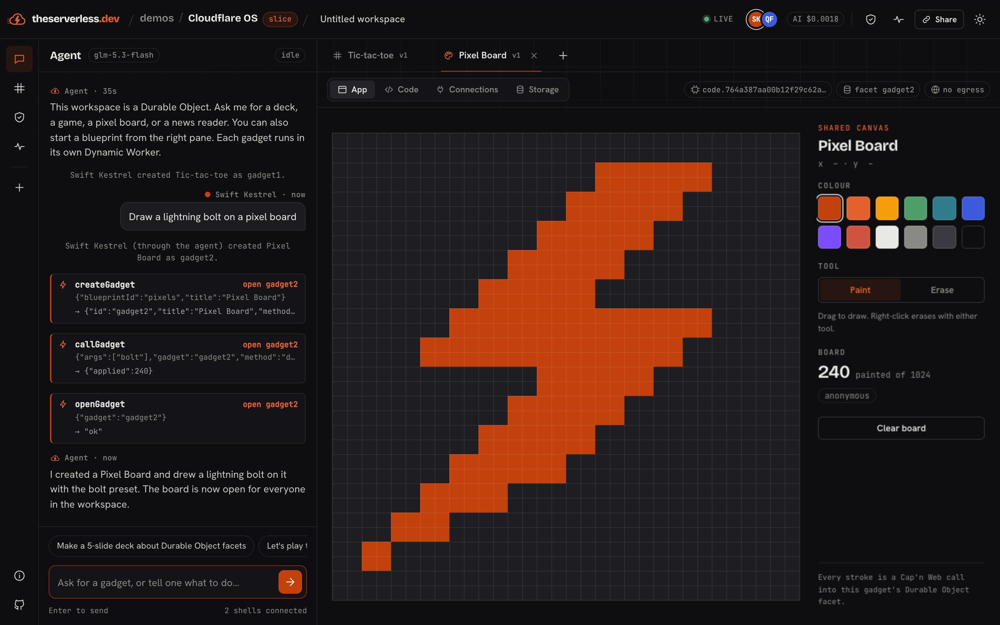

# Cloudflare OS, sliced

This demo is a small, faithful slice of [cloudflare/cloudflare-os](https://github.com/cloudflare/cloudflare-os). It runs on
Workers Paid. It does not use Workers for Platforms or Containers.

- **Live:** <https://tech-demos.theserverless.dev/demos/cloudflare-os/>
- **Subdomain:** <https://cloudflare-os.tech-demos.theserverless.dev/>
- **Plan:** [PLAN.md](./PLAN.md) compares the slice with the full upstream product.



## What a visitor sees

1. A workspace opens at a random `?w=` link. The link is the capability. Open it in a second tab to join live.
2. Click a blueprint, or ask the agent: "Draw a lightning bolt on a pixel board".
3. The gadget runs in its own Dynamic Worker, as a Durable Object facet with a private SQLite database.
4. The gadget UI runs in a sandboxed frame and calls the facet over Cap'n Web.
5. The Headlines gadget has no network. Its read of `hn.algolia.com` waits in the Activity queue until someone approves it.
6. The System drawer shows each RPC call with its facet time. The Storage tab shows the facet's own SQLite tables.

## Architecture

```
browser shell ──Cap'n Web WebSocket──▶ Worker (PublicApi)
      │                                   │ Workers RPC
      │ MessagePort (Cap'n Web)           ▼
sandboxed frame (client.js) ◀────── Workspace DO (SQLite)
                                          │ ctx.facets.get("gadgetN")
                                          ▼
                              Dynamic Worker (server.js) — class Gadget — own SQLite
                                          │ env.WEB / env.AI
                                          ▼
                                 Gatekeepers → approval queue → fetch / Workers AI
```

| File | Role |
|---|---|
| `src/worker/index.ts` | Routes, static assets, and the Cap'n Web `/api` endpoint |
| `src/worker/workspace.ts` | The `Workspace` DO: gadgets, files, chat, approvals, the facet loader, and the storage inspector |
| `src/worker/gatekeepers.ts` | `WebGatekeeper` (allowlist and approval) and `AiGatekeeper` (metered) |
| `src/worker/agent.ts` | The Workers AI tool loop (`glm-5.3-flash`) |
| `src/worker/meter.ts` | The global daily AI budget and the daily cap on new Dynamic Workers |
| `src/blueprints/*` | Slides, Tic-tac-toe, Pixel Board, and Headlines. [CONTRACT.md](./src/blueprints/CONTRACT.md) gives the gadget format |
| `src/client/*` | The Graphite and Ember shell and the sandboxed frame bridge |

## Run it

```bash
bun install
cd demos/cloudflare-os
bun run dev          # builds the shell, then runs wrangler dev on :8787
bun run typecheck
bun run deploy
```

The Workers AI binding always calls the remote service, even in `wrangler dev`.

Smoke tests:

```bash
bun run scripts/smoke.ts http://127.0.0.1:8787
bun run scripts/agent-check.ts https://tech-demos.theserverless.dev/demos/cloudflare-os "Draw a heart on a pixel board"
```

`smoke.ts` does not call the model. `agent-check.ts` calls Workers AI and costs about $0.002 for each turn.

## Cost guards

| Guard | Default | Where |
|---|---|---|
| Workers AI spend for each day, for all visitors. Each call reserves its worst-case cost first | `AI_DAILY_BUDGET_USD = 0.15` | `wrangler.jsonc`, `Meter` |
| New unique Dynamic Worker IDs for each day | `DYNAMIC_WORKER_DAILY_CAP = 60` | `wrangler.jsonc`, `Meter` |
| Agent turns for each IP | 6 each minute | `AGENT_LIMIT` binding |
| Gadget creates, code saves, and binding changes for each IP | 12 each minute | `CODE_LIMIT` binding |
| Gadget AI completions for each workspace | 6 each minute | `AGENT_LIMIT` binding |
| Gadget CPU and subrequests | 500 ms, 50 | Worker Loader `limits` |
| Gadgets in each workspace | 8 | `workspace.ts` |

Blueprints without bindings share one Dynamic Worker for each code hash, for all workspaces.

## Artifacts

- `artifacts/cloudflare-os-demo.mp4`: a 110-second walkthrough of the live demo
- `artifacts/01-…09-*.png`: screenshots of each step, including mobile
