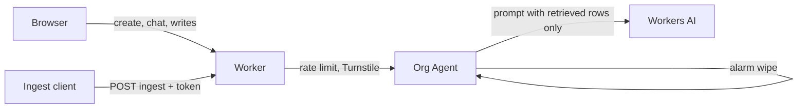

# Plan — company-brain

## Goal

A visitor opens a sandbox org and can read, add, and chat against that org's facts and decisions, with Workers AI answering only from that memory and citing the rows it used.

This is a **fresh small slice** inspired by [supermemoryai/company-brain](https://github.com/supermemoryai/company-brain) (Apache-2.0), not a vendor of that repo. Upstream post: https://x.com/DhravyaShah/status/2103668051468300701.

## Research (upstream)

Upstream is an org-scoped Agents SDK Durable Object (`CompanyBrainAgent`) in front of Slack. It keeps turn state in durable SQL, triages channel traffic, and calls tools. Connectors and a separate database hold the wider product.

| Upstream | This slice |
| --- | --- |
| One Durable Object per org | Same idea: one `Org` Agent per sandbox org |
| Slack events, Linear, GitHub | **Cut.** Manual add plus one token-protected ingest POST |
| Postgres plus DO SQL for turns, approvals, cursors | DO SQLite only: `facts`, `decisions`, chat transcript, credential hashes |
| Model loop with tools, triage, approvals, billing | One grounded Workers AI call. No tools |
| Long-lived customer orgs | Per-visitor org. Unguessable id, session token, DO alarm wipe |

**Cut:** Slack, Linear, GitHub, and any other connector; triage; tool calling; approvals; billing; fibers; Postgres; cross-org memory; Workers for Platforms.

## Single-user MVP

- In:
  - One Worker + static Graphite & Ember UI (chat pane, memory pane, Contact link to the hub).
  - `Org` extends Agents SDK `Agent`. SQLite rows for facts and decisions (`text`, `author`, `source`, `created_at`).
  - Create org seeds a few Northline examples. Session token (cookie + bearer). Ingest token returned once, stored as a SHA-256 hash.
  - Chat calls Workers AI with only the retrieved rows. The reply shows fact/decision ids and snippets. No relevant rows, or an ungrounded model reply, becomes "I don't know."
  - `POST /api/orgs/:id/ingest` with the ingest token. Body size cap. Rate limit.
  - Rate limits on create, chat, and writes. Turnstile on create and chat. Test keys on localhost; missing production secret fails closed.
  - DO alarm (Agents SDK `schedule`, delivered as the Durable Object alarm) wipes the org at the TTL.
  - Smoke test proves org A cannot read or write org B.
- Out: everything in the research cut list, plus Vectorize, real Slack signatures, and multi-member orgs.

## Tasks

1. `Org` agent: schema, seed, session and ingest hashes, alarm wipe.
2. HTTP API: create, memory, manual add, chat, ingest.
3. Retrieval + Workers AI grounding, with citations or "I don't know."
4. Turnstile and rate-limit bindings on the public write and AI paths.
5. Vanilla TS UI, Bun bundle, path prefix for `/demos/company-brain/`.
6. Hub fallback redirect. Smoke, screenshot, video.

## Stack

- **Workers + Static Assets** — same hosting pattern as resolve-hq, `run_worker_first` so `/api` stays on the Worker.
- **Agents SDK `Agent` + DO SQLite** — one org is one durable database, which is the isolation boundary.
- **Workers AI** — grounded answers without an outside model key.
- **Rate Limit + Turnstile** — Paid-plan controls on create and chat.
- **No Hono, no React, no Slack SDK, no Vectorize.**

## Architecture

Worker `tech-demos-company-brain`:

- `tech-demos.theserverless.dev/demos/company-brain*`
- `company-brain.tech-demos.theserverless.dev/*`

`migrations/0001_org.sql` is the DO schema. `Org.onStart` applies it. There is no D1 database.

## Cost

- One DO per visitor, wiped on a 24 hour alarm.
- Chat caps `max_tokens` at 280 and is rate-limited per IP. Create and chat also require Turnstile.
- No Containers, Browser Rendering, Vectorize, or Workers for Platforms.

## Testing

- `bun run typecheck`
- `scripts/smoke.ts` against `wrangler dev`: seed memory, cross-org denial, ingest token, "I don't know", and a grounded chat (or a clear AI failure).
- Screenshot and a short Playwright video.

## Deferred

- Vector recall across a large memory.
- Signed Slack, Linear, or GitHub webhooks.
- Shared orgs with more than one member.
- Editing or deleting a single row before the TTL wipe.
