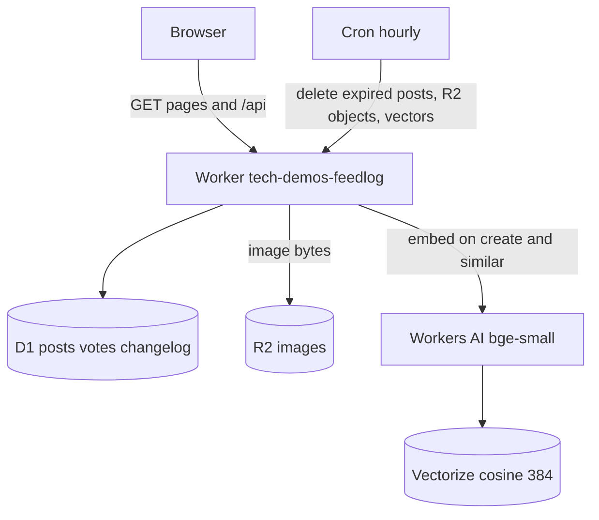

# Plan — feedlog

## Goal

A visitor opens one public feedback board on Workers, posts an idea, upvotes, reads a three-column roadmap and a changelog, and sees likely duplicates while typing.

This is a **fresh small slice**, not a vendor of [linkcraftstudio/feedlog](https://github.com/linkcraftstudio/feedlog) (MIT). Upstream is Nuxt 4, Postgres with pgvector, and OpenAI embeddings. The brief fixes this demo on the plain Worker stack.

## Research

Upstream (public README and Cloudflare deploy guide, not a code port):

| Upstream | This slice |
| --- | --- |
| Nuxt 4, Vue, Drizzle, Tailwind, shadcn-vue | One Worker, static assets, vanilla TS |
| Postgres 17 + pgvector (Hyperdrive) | **D1** for posts, votes, changelog |
| OpenAI `text-embedding-3-large` (768) | **Workers AI** `@cf/baai/bge-small-en-v1.5` (384) + **Vectorize** cosine |
| better-auth (email, Google, GitHub, admin role) | Anonymous visitor cookie. Admin token for status and changelog |
| Comments, categories, private boards, drag-and-drop roadmap | Cut |
| AI-drafted changelog presets | Cut. Changelog is admin-written |
| R2 mentioned for blobs on Workers | **R2** optional image on a post (type allowlist, size cap, magic bytes) |
| No Turnstile in the README | **Turnstile** on new posts, uploads, and similar-post queries |

Framework subagents were not used. The brief already rules out Nuxt and names the Worker bindings. resolve-hq in this repo is the layout to copy.

**Cut:** accounts, OAuth, comments, multi-board, merge workflow, drag-and-drop, email notifications, AI changelog drafting, Postgres, Workers for Platforms.

## Single-user MVP

- In:
  - Board of posts (title, body, status, one vote per visitor, optional image).
  - Statuses: open, planned, in progress, done, closed.
  - Roadmap columns for planned / in progress / done.
  - Changelog page.
  - D1 seed posts and entries. Visitor posts expire (14 days). Hourly cron deletes them and their vectors. Cap at 80 visible posts.
  - Similar posts while typing: Workers AI embed + Vectorize query, debounced, rate-limited, Turnstile-gated. Index on create. Delete vectors when the post expires.
  - If those bindings throw (no local Vectorize simulation, and this environment has no Cloudflare login), the same endpoint falls back to word overlap and says so.
  - `ADMIN_TOKEN` (constant-time compare) for status changes, changelog writes, and cleanup.
  - Rate limits on post, vote, similar, and admin.
  - Turnstile on gate, create, and similar. Loopback uses Cloudflare’s always-pass test keys when the secret is unset. Any other host fails closed.
  - Hub registry redirect. Graphite & Ember UI. Contact CTA to theserverless.dev.
- Out: everything in the research “Cut” list.

## Tasks

1. D1 schema, seed, expiry, vote uniqueness, post cap.
2. HTTP API for board, roadmap data, changelog, votes, images, admin.
3. Turnstile gate cookie so debounced similar-checks do not burn a one-time token on every keystroke.
4. Embed + Vectorize index/query/delete, with a labeled word-overlap fallback.
5. Vanilla TS UI: board, roadmap, changelog, admin token kept in the tab session.
6. Smoke script against the local API. Screenshot and video.
7. Deploy only if `wrangler whoami` is authenticated. It is not, in this environment.

## Stack

- **Workers + Static Assets**, `run_worker_first`, so `/api` is never swallowed by the asset router. Same hosting shape as resolve-hq.
- **D1** for the board. Relational votes fit SQL, and the demo stays inside Paid.
- **R2** for image bytes. D1 stores the key and the sniffed content type.
- **Workers AI + Vectorize** for duplicate spotting. bge-small is 384 dimensions, which keeps the index small. The index metric is cosine and cannot be changed later.
- **Rate limiting bindings** (`7341`–`7344`, after the ids already used in this repo: 7301–7331). kmem had no note on namespace ids.
- **Turnstile** because create and embed are the costly public writes.
- **Cron** for TTL. No Durable Object: expiry is a sweep, not per-post coordination.
- **No Hono, no Nuxt, no Zod, no OpenAI, no Postgres.** Guards are hand-written, as in resolve-hq.

## Architecture

Worker `tech-demos-feedlog`:

- `tech-demos.theserverless.dev/demos/feedlog*`
- `feedlog.tech-demos.theserverless.dev/*`

The client uses hash routes (`#/board`, `#/roadmap`, `#/changelog`, `#/p/…`) so asset URLs stay relative to whichever prefix served `index.html`.

## Cost

- D1, R2, and a 384-dim index stay inside typical Paid usage for a demo.
- Similar-post embeds are rate-limited (20/minute/IP) and require a Turnstile gate.
- New posts are 20/minute/IP. Votes are 40/minute/IP.
- No Containers, Browser Run, or Workers for Platforms.

## Testing

- `bun run typecheck`
- `scripts/smoke.ts` against `wrangler dev`: seed list, vote toggle, Turnstile rejection, similar-post hit, image allowlist, admin rejection, cleanup of an already-expired loopback post.
- Playwright screenshot and short video of the running UI.

## Deferred

- Real Turnstile widget hostnames and `ADMIN_TOKEN` (owner secrets; this environment has no Cloudflare login).
- Email when a voted post ships.
- Comments, merge, and drag-and-drop on the roadmap.
- AI-written changelog drafts.
