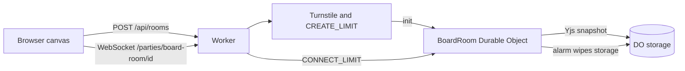

# Plan — partyserver

## Goal

A visitor creates a short-lived ink room and draws with someone in another tab, with strokes and cursors synced through a hibernating PartyServer Durable Object and still there after a refresh until the room alarm wipes them.

This is an **inspired-by slice** of [cloudflare/partykit](https://github.com/cloudflare/partykit) (PartyServer + Y-PartyServer; ISC; originally Sunil Pai / threepointone), not a vendor of that monorepo. Prompt: [@_thebluebutter](https://x.com/_thebluebutter/status/2105331683000234478).

## Research

Published packages `partyserver`, `y-partyserver`, `partysocket`, and `yjs` absorb the room router, the hibernating WebSocket lifecycle, and the Yjs sync protocol. The demo only adds the board, the caps, and the gate.

| Upstream | This slice |
| --- | --- |
| `Server` + `routePartykitRequest` | One `BoardRoom` binding, party `board-room`, hibernation on |
| `YServer` (`onLoad` / `onSave`, awareness) | Y.Map of strokes in DO storage; cursors stay on the awareness channel |
| `YProvider` | Browser bundle, BroadcastChannel off so two tabs meet only on the Durable Object |
| partysub / partywhen / full PartyKit platform | Cut |

Distinct from edgechat (team chat transcript) and goodvibes (Three.js presence): this room is a shared canvas, not a message log and not a 3D scene.

## Single-user MVP

- In:
  - Standalone Worker + static Graphite & Ember UI (LogoMark, Bricolage / Hanken, ember `#c2410c`, background `#0e0e11`).
  - Create an anonymous room behind Turnstile and a rate-limit binding. Join link is an unguessable id.
  - Hibernating `BoardRoom`: Yjs strokes, live cursors, presence names.
  - Persist the Yjs snapshot in Durable Object storage. Reload shows the same ink.
  - Caps: 8 connections, 240 strokes, 256 KB snapshot. Per-connection frame meter.
  - DO alarm at 2 hours deletes storage and closes sockets.
  - Works at `/demos/partyserver/` and at the demo subdomain.
  - Hub fallback redirect. `PLAN.md` / `README.md` / `CHANGELOG.md`.
- Out: accounts, named workspaces, chat transcript, file uploads, Workers AI, D1/R2/KV, partysub, partywhen, Workers for Platforms.

## Tasks

1. `BoardRoom` Yjs Durable Object: load/save, caps, alarm wipe, connection and frame meters.
2. HTTP: config, Turnstile-gated create, public room status. No display names in storage.
3. Canvas UI: pen, eraser, undo mine, cursors, presence, expiry.
4. Smoke against `wrangler dev`, including a prefixed WebSocket and a second client.
5. Deploy if credentials exist; otherwise document owner steps. Screenshot, video, one PR.

## Stack

- **Workers + Static Assets** — same standalone shape as resolve-hq, path prefix stripped for assets.
- **PartyServer + Y-PartyServer** — hibernating rooms and a Yjs provider, instead of a hand-rolled sync protocol.
- **Durable Object storage + alarm** — anonymous room state and TTL without D1.
- **Rate-limit bindings + Turnstile** — create and WebSocket upgrade. Frame meter stays in the DO so a cursor does not take a remote hop.
- **No Hono, no React.** Vanilla TS bundled with Bun.

## Architecture

Worker `tech-demos-partyserver`:

- `tech-demos.theserverless.dev/demos/partyserver*`
- `partyserver.tech-demos.theserverless.dev/*`

## Cost

- One SQLite Durable Object class. No D1, R2, KV, AI, Containers, or Browser Rendering.
- Room create is 8/minute per IP. WebSocket upgrades are 40/minute per IP.
- Each room holds at most 8 sockets and 256 KB, then the alarm deletes it.

## Testing

- `bun run typecheck`
- `scripts/smoke.ts` against `wrangler dev`: health under the path prefix, Turnstile create, Yjs sync across two providers, reload from storage, 9th socket refused, frame flood closed, stroke cap.
- Browser screenshot and a short two-tab video.

## Deferred

- Sliding TTL (the alarm is a fixed 2 hours from create).
- Auth, private rooms, and moderation.
- A server-side undo stack beyond deleting your own stroke ids.
- Workers AI captioning of the board.
