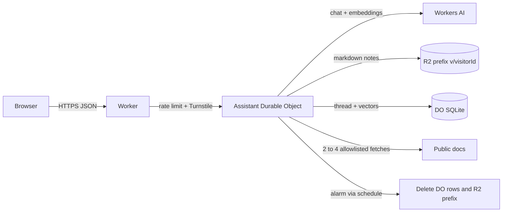

# Plan — personal-agent

## Goal

A visitor chats with one personal assistant whose conversation, markdown notes, and recall index live in a single Durable Object, and can see which notes were used in each reply.

This is an **inspired-by slice** of [DomWane/workers-personal-agent](https://github.com/DomWane/workers-personal-agent) (MIT), not a vendor of that repo. The X post that pointed at it is [tonycasavan/status/2101803028315537806](https://x.com/tonycasavan/status/2101803028315537806).

## Research (upstream)

Upstream is one Worker plus several Durable Objects (thread, embedding index, research scouts, MCP clients), a Vue client, and optional third-party model and search keys.

| Upstream | This slice |
| --- | --- |
| One Agents SDK Durable Object per conversation, WebSocket `setState` broadcast | One Agents SDK Durable Object per anonymous visitor. HTTP JSON in, thread stored in DO SQLite. No WebSocket. |
| Markdown vault in R2 (memories, profile, skills) | Markdown notes in R2 under `v/<visitorId>/`. Title, embedding, and keywords in that visitor's DO SQLite. |
| Embedding index in its own Durable Object, Workers AI or any OpenAI-compatible API | Workers AI `@cf/baai/bge-small-en-v1.5` embeddings stored in the same DO. Cosine in the DO. Keyword overlap when the embedding binding fails. No `LLM_API_KEY`, no `CF_API_TOKEN`. |
| Deep research: plan card, child scout Durable Objects, Tavily / Firecrawl / Browser Rendering | One research call fans out 2–4 `fetch`es (host allowlist, size and time caps, no private addresses), then a Workers AI summary with URL citations. |
| Cloudflare Access in front of the whole Worker | Turnstile on chat, research, and note writes. Fail closed when `TURNSTILE_SECRET` is missing. |
| Subrequest budgets, history compaction, skills, reminders, MCP, nightly reflection | Cut. A Durable Object alarm (via Agents SDK `schedule`, which owns the alarm slot) deletes the DO rows and the R2 prefix 24 hours after the last write. |

**Cut:** WebSocket UI, Vue/Tailwind, scout Durable Objects, MCP, skills, reminders, history compaction, third-party search keys, Browser Rendering, Cloudflare Access, OpenAI-compatible providers, Workers for Platforms.

## Single-user MVP

- In:
  - One Worker + static Graphite & Ember UI (Bricolage Grotesque, Hanken Grotesk, ember `#c2410c` on `#0e0e11`). Contact CTA to the parent site, brand link back to the hub.
  - Anonymous visitor id in `localStorage`. That id is the Durable Object name.
  - Chat that recalls up to three notes and shows title + score under the reply.
  - Create, view, and delete markdown notes. Bodies in R2, vectors in DO SQLite.
  - Research: 2–4 allowlisted fetches, or a built-in docs catalog when the visitor leaves the URL list empty.
  - `CHAT_LIMIT` and `RESEARCH_LIMIT` (plus a read limit). Turnstile on chat, research, and note writes.
  - 24-hour alarm expiry of that visitor's DO storage and R2 prefix.
  - Hub registry fallback redirect. `PLAN.md` / `README.md` / `CHANGELOG.md`.
- Out: everything in the research “Cut” row. No accounts, no PII fields, no third-party API keys.

## Tasks

1. Worker router with base-path handling, rate limits, and Turnstile.
2. `Assistant` Durable Object: thread, notes, recall, alarm expiry.
3. R2 markdown notes and SQLite cosine recall, with a keyword fallback.
4. Research fetch with allowlist, caps, and a cited summary.
5. Vanilla TS UI: chat with recall chips, note list, research panel.
6. Smoke script against the local API. Screenshot and video.
7. Hub registry entry. Deploy if credentials exist.

## Stack

- **Workers + Static Assets** — same hosting pattern as resolve-hq, path prefix and subdomain.
- **Agents SDK Durable Object (SQLite)** — one named instance per visitor holds the thread and the recall index. `schedule()` is the alarm.
- **R2** — note bodies stay markdown files, separate from the chat rows.
- **Workers AI** — chat and embeddings with no third-party key. Both paths fail soft.
- **Rate Limit bindings + Turnstile** — public AI and write paths fail closed without the secret.
- **No Vue, no Tailwind, no Hono, no Vectorize.** Per-visitor vectors in the DO are simpler than a shared Vectorize index plus a metadata filter.

## Architecture

Worker `tech-demos-personal-agent`:

- `tech-demos.theserverless.dev/demos/personal-agent*`
- `personal-agent.tech-demos.theserverless.dev/*`

## Cost

- One Durable Object and a handful of R2 objects per visitor, deleted after 24 hours.
- Chat and embeddings are rate limited. Research is capped at four fetches and four requests a minute per IP.
- No Containers, Browser Rendering, Vectorize, or Workers for Platforms.

## Testing

- `bun run typecheck`
- `scripts/smoke.ts` against `wrangler dev`: health, Turnstile rejection, note round-trip, recall on chat, research citations, delete, and a second visitor who cannot read the first visitor's note.
- Browser screenshot and a short Playwright video.

## Deferred

- WebSocket broadcast and a multi-thread sidebar.
- Scout Durable Objects and a research plan card.
- MCP tools, skills, reminders, and history compaction.
- A real Turnstile widget hostname list beyond the documented owner steps. Local dev uses Cloudflare's always-pass test keys.
