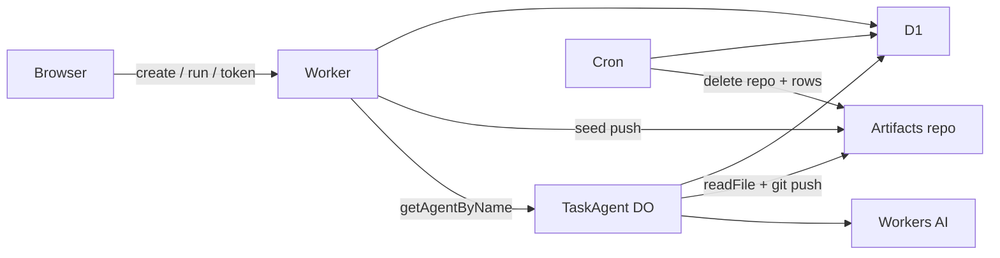

# Plan — repo-per-agent

## Goal

A visitor creates a short-lived task, gets one Agents SDK agent and one Cloudflare Artifacts git repo, and watches that agent commit Workers AI edits to a three-file tree, with a commit log, a diff, and a short-lived read-only clone token.

Inspired by [choyiny/gitorange](https://github.com/choyiny/gitorange) (Apache-2.0). This is a slice, not a port.

## Proof that Artifacts works here

Checked before any demo code, on account `3f847e2fadeef3e583701e8fa25657b5` (Workers Paid, user `serverlessdev@anks.in`):

- Docs: [Artifacts open beta, 1 Oct 2026](https://developers.cloudflare.com/changelog/post/2026-10-01-artifacts-open-beta/), [Workers binding](https://developers.cloudflare.com/artifacts/api/workers-binding/), [Git protocol](https://developers.cloudflare.com/artifacts/api/git-protocol/).
- `GET /accounts/…/artifacts/namespaces` returned 200 and an empty list (the product is enabled, not a waitlist 403).
- `POST` created namespace `tech-demos` (201).
- `POST` created repo `probe-repo-per-agent`. Remote: `https://3f847e2fadeef3e583701e8fa25657b5.artifacts.cloudflare.net/git/tech-demos/probe-repo-per-agent.git`.
- `git push` of `README.md` (`probe ok`) succeeded. `git clone` read the same commit `f130ae5932d097f76ba0e78d22d2de6f088ac062` and file body.
- REST `…/log` and `…/file` returned that commit and `probe ok`.
- The probe repo was deleted afterwards. Namespace `tech-demos` stays for this demo.

kmem has no prior Artifacts claims. The API calls above are the source of truth.

## Research (upstream)

GitOrange is a single-tenant GitHub-style host: Artifacts for git bytes, D1 for everything else, Workers AI for merge conflicts, Containers for Actions. This demo keeps the Artifacts-per-unit-of-work idea and drops the host.

| Upstream | This slice |
| --- | --- |
| Many repos per org, members, invites | One Artifacts repo per anonymous task |
| Personal access tokens, full git host UI | One read-only clone token, 10 minutes, shown once in the page |
| PRs, review, auto-merge, Actions on Containers | Cut. No Containers |
| AI conflict resolution inside a sandbox | One Workers AI edit of a fixed three-file tree, pushed as a real git commit |
| Email Sending, OAuth MCP | Cut |

## Single-user MVP

- In:
  - Standalone Worker + Graphite & Ember UI.
  - `TaskAgent` (Agents SDK SQLite Durable Object), one instance per task.
  - Artifacts namespace `tech-demos`, repo `task-<16 hex>` created through the binding.
  - Seed commit, then each run asks Workers AI for one full-file edit and pushes it with a short write token. The binding has no commit method; the data plane is Git smart HTTP, same as GitOrange.
  - Commit log and unified diff from `log` / `readTree` / `readFile`.
  - D1 `tasks` + `activity`.
  - Cron `*/15 * * * *` deletes expired repos and their log rows (6 hours).
  - At most 3 live repos per visitor cookie.
  - Turnstile + rate limits on create and run. Rate limit on token mint. Visitor cookie required to read, run, or mint.
- Out: pull requests, branches other than `main`, Actions, Containers, LFS, multi-user auth, importing GitHub repos, write tokens in the UI.

## Tasks

1. Git object + pack + `receive-pack` push that Artifacts accepts.
2. D1 schema, visitor cookie, Turnstile, rate limits, repo cap.
3. Create task: Artifacts repo, seed commit, agent instance, activity row.
4. Agent run: read files, Workers AI JSON edit, push, activity row.
5. Commit list, diff, read-only clone token.
6. Cron cleanup.
7. UI, hub registry redirect, smoke, typecheck.

## Stack

- **Workers + Static Assets** — same hosting pattern as resolve-hq, path prefix and subdomain.
- **Artifacts binding** — one git repo per task. Proven on this account. Writes go over Git smart HTTP because the binding is control-plane only.
- **Agents SDK Durable Object** — one agent instance per task, with its own SQLite state for the run phase.
- **Workers AI** (`@cf/zai-org/glm-5.3-flash`) — authors the file the agent commits. A failed model call does not invent a commit.
- **D1** — task and activity rows the cron can delete.
- **Rate limit bindings + Turnstile** — public create/run/token paths.
- **Cron** — TTL. No Queues, R2, Vectorize, or Containers.

## Architecture

Worker `tech-demos-repo-per-agent`:

- `tech-demos.theserverless.dev/demos/repo-per-agent*`
- `repo-per-agent.tech-demos.theserverless.dev/*`

## Testing

- Blob hash matches `git hash-object` for `hello\n`.
- `scripts/smoke.ts` against `wrangler dev`: health, Turnstile rejection, create, seed commit read-back, agent run, diff, read token, visitor isolation.
- Browser pass on the create → run → diff flow.

## Deferred

- Extra branches, pull requests, and review.
- Write-scoped tokens in the UI.
- Importing an existing remote.
- Per-task alarms instead of the account cron (the cron is enough at this cap).
