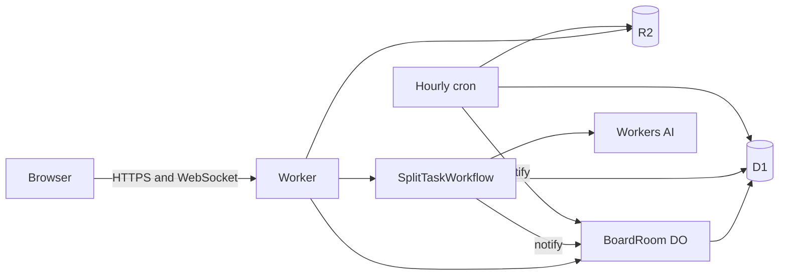

# Plan — tanbase

## Goal

A visitor gets an anonymous kanban board on Workers and can add, edit, drag, and attach files to cards while a second tab stays in sync, then ask Workers AI to split one card into subtasks.

This is a **fresh small slice**, not a vendor of [tanfust/tanbase-core](https://github.com/tanfust/tanbase-core) (MIT).

## Research (upstream)

Upstream is one TanStack Start Worker that maps each Cloudflare primitive onto a board feature. It is not Workers for Platforms.

| Upstream | This slice |
| --- | --- |
| D1 via Drizzle: projects, tasks, auth, AI usage | D1 `visitors`, `boards`, `tasks`, `attachments`, `reminders`, `splits` |
| Better Auth accounts | Anonymous visitor cookie. No accounts. |
| Turnstile on sign-up / sign-in | Turnstile on create-board, upload, and AI split. Fail closed without `TURNSTILE_SECRET`. |
| Rate limits `AUTH_LIMITER`, `AI_LIMITER` | `WRITE_LIMIT`, `UPLOAD_LIMIT`, `AI_LIMIT` |
| R2 attachments, 10 MB | R2 attachments, 256 KB, content-type allowlist, sniffed bytes |
| `BoardRoom` Durable Object, hibernating WebSockets | Same idea: one DO per board, `ctx.acceptWebSocket`, live create/move/edit/delete |
| Hourly cron → Queue → Email Service reminders | Hourly cron marks overdue tasks and writes a reminder log. No email, no queue. |
| Workflow `BREAKDOWN` + Workers AI via AI Gateway, 3–7 subtasks | Workflow `SPLIT_TASK` + Workers AI binding, 3–6 subtasks. Steps stored in D1 so the UI can show them. Fail soft to fixed subtasks if the model output is unusable. |
| MCP OAuth, blog, OG images, TanStack kitchen sink | Cut |

**Cut:** TanStack Start / Router / Query / Form / Table / Charts / Markdown, React, Drizzle, Better Auth, Email Service, reminder email, MCP, blog, link-preview images, AI Gateway, Workers Caching, Workers for Platforms.

**Resource names:** prefix `tech-demos-tanbase` (Worker, D1, R2, Workflow). Bindings stay short (`DB`, `FILES`, `BOARD`, `SPLIT_TASK`, `AI`).

## Single-user MVP

- In:
  - One Worker + static Graphite & Ember kanban (Bricolage / Hanken, ember `#c2410c`, background `#0e0e11`). Contact CTA links to the hub.
  - Columns **To do / Doing / Done**. Cards have title, description, due date. Drag-and-drop plus a move control.
  - D1 is the store. One `BoardRoom` Durable Object per board fans changes out over hibernatable WebSockets.
  - Anonymous boards: `tb_vid` cookie, max 3 boards, max 40 tasks, 7-day TTL. Hourly cron deletes expired boards and their R2 objects.
  - R2 attachments behind Turnstile, rate limit, size cap, and an allowlist.
  - A Workflow splits a task into 3–6 subtasks. The three steps show in the card drawer. Turnstile + AI rate limit.
  - Cron reminder stub (log + overdue flag, no email).
  - Hub registry fallback redirect. `PLAN.md` / `README.md` / `CHANGELOG.md`.
- Out: everything in the research “Cut” row, plus accounts, real email, and AI Gateway.

## Tasks

1. D1 schema and visitor/board/task queries with ownership checks.
2. `BoardRoom` mutations and hibernating WebSocket broadcast.
3. HTTP API: session, boards, tasks, attachments, split, split status.
4. `SplitTaskWorkflow`: load task, Workers AI, write subtasks, notify the DO.
5. Hourly sweep: overdue reminder log, TTL delete + R2 delete.
6. Vanilla TS board UI, Bun bundle, path prefix `/demos/tanbase/`.
7. Hub fallback entry (append only).
8. Smoke, typecheck, screenshot, video, PR. Deploy only if this environment has Cloudflare credentials.

## Stack

- **Workers + Static Assets**, `run_worker_first` — one origin for the page, the API, and the WebSocket.
- **D1** — boards and tasks the cron can query without waking every DO.
- **Durable Object (SQLite class)** — per-board serialisation and `ctx.acceptWebSocket` fanout.
- **R2** — attachment bytes, deleted with the board.
- **Workflows + Workers AI** — the split is a visible multi-step job, not a single fetch.
- **Rate Limiting + Turnstile** — public writes are capped; create, upload, and AI fail closed without the secret.
- **Cron** — overdue flag and TTL cleanup.
- **No Hono, no React, no Drizzle, no zod package** — hand-written guards, same as resolve-hq.

## Architecture

Worker `tech-demos-tanbase`:

- `tech-demos.theserverless.dev/demos/tanbase*`
- `tanbase.tech-demos.theserverless.dev/*`

## Cost

- D1, R2, DO, and Workflow demo traffic stays inside Paid included amounts.
- AI calls cap `max_tokens` at 600 and are rate-limited per IP, behind Turnstile.
- Boards, tasks, and uploads are count- and size-capped, then deleted after 7 days.
- No Containers, Browser Rendering, Vectorize, Email Service, or Workers for Platforms.

## Testing

- `bun run typecheck`
- `scripts/smoke.ts`: create board, task CRUD, two WebSocket clients, attachment round-trip, rejected upload, workflow split (Workers AI or fallback), overdue reminder, TTL sweep.
- Browser screenshot and a short video.

## Deferred

- Accounts and memberships.
- Reminder email and the Email Service queue.
- MCP / OAuth, blog, OG images, AI Gateway.
- List view, charts, and the TanStack kitchen sink.
