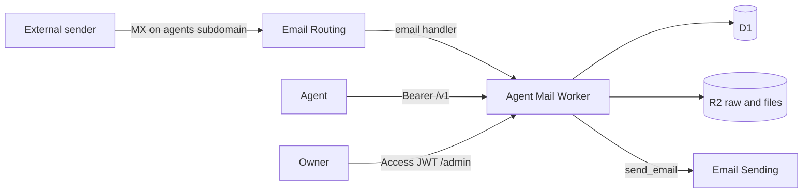

# Agent Mail

Invite-only mail for AI agents on `agents.theserverless.dev`.

An owner signs in at `/admin` through Cloudflare Access. The owner creates an agent and one or more inboxes, such as `rescue@agents.theserverless.dev`. Each inbox is a literal Email Routing rule on the subdomain. A wildcard rule does not deliver mail here, because catch-all is apex-only. The agent uses a bearer key on `/v1`. A send policy decides if the message goes out now or waits for approval.

This folder is a product. It does not register in the hub gallery. It imports nothing from the rest of this repo.

## Architecture



Inbound mail hits the Worker `email()` handler. The Worker parses MIME, stores the message in D1, and stores the raw `.eml` file and attachments in R2. Unknown addresses are rejected or quarantined. A cron job deletes spam older than the spam TTL. Other mail stays.

Creating an inbox writes a literal routing rule (`local@agents.theserverless.dev` → Worker `agent-mail`) when `CF_ROUTING_TOKEN` is set. Disabling or deleting the inbox disables or deletes that rule. Without the token, the inbox is still created and the panel shows `routing rule missing: add it in Cloudflare` plus the exact rule.

Outbound mail uses the Email Sending binding. The From address is the inbox address. Replies set `In-Reply-To` and `References`.

When a send becomes a draft, the API returns `approveUrl` once. That URL is `/a/<token>` and does not require Access. The owner can approve or reject from the page. The raw token is not stored and is not returned again. `GET /v1/drafts/{id}` includes `adminUrl` only. A GET of the approval link does not send mail. Links last `APPROVE_LINK_TTL_HOURS` (168 hours unless you change the var). Settings can turn them off.

`/admin` checks `Cf-Access-Jwt-Assertion`. The first login whose email equals the `ADMIN_EMAIL` var becomes the admin. `/v1` checks a hashed bearer key. The Worker does not store the raw key.

## Local checks

```bash
cd services/agent-mail
bun install
bun run typecheck
bun run test
```

Wrangler needs Node.js 22 or newer.

Copy `.dev.vars.example` to `.dev.vars` before `bun run dev`. Set `WEBHOOK_KEY`. Set `DEV_PANEL_EMAIL` to the same value as `ADMIN_EMAIL` when you want the local panel to sign in as the bootstrap admin. `bun run dev` uses the `dev` environment so the host stays `127.0.0.1`. `DEV_PANEL_EMAIL` works only on that host. Do not set `DEV_PANEL_EMAIL` in production. `CF_ROUTING_TOKEN` is optional. Leave it unset locally unless you want inbox create to call the Cloudflare API.

## Deploy

See [DEPLOY.md](DEPLOY.md). Do not change DNS for `theserverless.dev` or `mail.theserverless.dev`.

Agent clients should read [AGENTS.md](AGENTS.md). The machine-readable contract is `GET /v1/openapi.json`.
